# BlockMed + Blockchain (Super Basic) — Bangla + English Mix

এই ডকটা **University students** দের জন্য—একদম **zero assumption**।
আপনি lecturer হিসেবে এটা ক্লাসে দেখাতে পারবেন: **word-by-word, task-by-task**।

---

## 0) One-line idea (এক লাইনে)

**Blockchain = Digital Khata (ডিজিটাল খাতা)**  
যেখানে নতুন লেখা **add** করা যায়, কিন্তু পুরনো লেখা **edit/delete** করা যায় না (practically).

BlockMed এই “খাতা” ব্যবহার করে:
- **Prescription verify** করতে
- **One-time dispense** নিশ্চিত করতে
- **Fake / reused prescription** ধরতে

---

## 1) First, the 5 words you must know (৫টা শব্দ)

### 1.1 Ledger (লেজার / খাতা)
- **Meaning**: Record book / database / খাতা
- **Job**: সব entry/record এখানে জমা থাকে

### 1.2 Transaction (ট্রানজ্যাকশন)
- **Meaning**: Ledger-এ **একটা নতুন entry যোগ করা**
- **Example (BlockMed)**:
  - “Doctor creates prescription” = 1 transaction
  - “Pharmacy dispenses prescription” = 1 transaction

### 1.3 Block (ব্লক)
- **Meaning**: অনেকগুলো transaction একসাথে (একটা bundle)
- **Example**: একই সময়ে অনেক prescription create/dispense হলে—সেগুলো এক ব্লকে থাকতে পারে

### 1.4 Chain (চেইন)
- **Meaning**: Block + Block + Block = chain (sequence অনুযায়ী linked)

### 1.5 Smart Contract (স্মার্ট কন্ট্র্যাক্ট)
- **Meaning**: Blockchain-এর উপর চলা **program / rules**
- **Job**: কে কী করতে পারবে, কোন prescription valid—এসব rule enforce করে

---

## 2) Why Blockchain was needed (কেন লাগলো)

### Traditional system (central)
- Data এক জায়গায় থাকে (single server / single authority)
- Admin/owner চাইলে data edit/delete করতে পারে
- Dispute হলে “কার data সত্য?” — ঝামেলা

### Blockchain system (shared)
- Data অনেক node-এ copy থাকে (many computers)
- সবাই একই history দেখে
- Rule ভাঙলে network reject করে

**Simple takeaway**: Blockchain gives **trust without one central boss**.

---

## 3) “Change করা যায় না” — কেন?

Blockchain-এ blocks **linked** থাকে।
একটা পুরনো block change করতে গেলে:
- ওই block-এর link/signature বদলে যাবে
- পরের blocks-ও mismatch হবে
- network immediately “tampering” ধরে ফেলবে

এজন্য blockchain-এ normal “database edit” এর মত করে পিছনের record ঠিক করা যায় না।

---

## 4) Visual: Block → Blockchain (ছোট diagram)

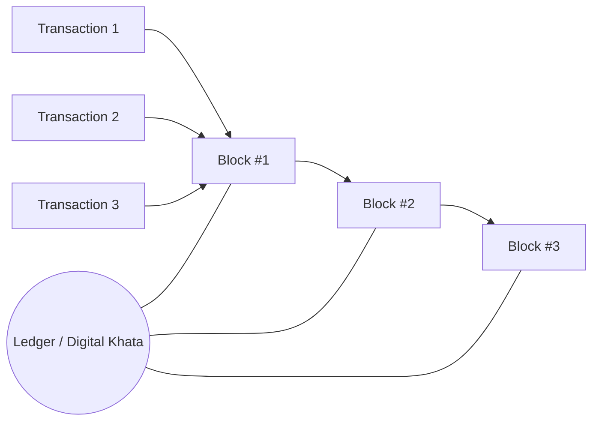

---

## 5) Wallet (ওয়ালেট) — Identity (পরিচয়)

Blockchain-এ “login by username/password” না—বেশিরভাগ সময় হয় **wallet** দিয়ে।

### 5.1 Wallet contains
- **Address (Public)**: account number এর মতো (সবাই দেখতে পারে)
- **Private Key (Secret)**: password এর মতো (কাউকে দেয়া যাবে না)

### 5.2 Simple example
- “এই prescription কে বানিয়েছে?” → doctor’s **address**
- “Doctor সত্যি doctor?” → smart contract role + verification rules

---

## 6) Smart Contract = Rules (If/Else)

এটা মানুষ না—**code**।

### Example rule (BlockMed idea)

```text
If prescription exists AND active AND not expired AND not dispensed
  → VALID
Else
  → INVALID
```

**Key point**: rule একবার deploy হলে—সবাইকে একই rule follow করতে হয়।

---

## 7) On-chain vs Off-chain (খুব সহজে)

### On-chain (blockchain-এ)
- Public + permanent
- Verification-এর জন্য minimum data

### Off-chain (database / server / file system)
- Private data রাখা যায়
- Search/analytics fast

BlockMed best practice:
- **Never store PII on-chain** (patient name, phone, NID etc.)
- On-chain: only **hash / ID / status**

Visual map:

```mermaid
flowchart TB
  subgraph OnChain [On-chain (Blockchain)]
    P1[Prescription ID]
    P2[patientHash (no raw PII)]
    P3[expiresAt]
    P4[isDispensed: true/false]
    P5[doctor address]
  end

  subgraph OffChain [Off-chain (Database / App Storage)]
    O1[Patient name, age, address]
    O2[Full prescription details (private)]
    O3[UI history & fast search]
  end

  UI[BlockMed UI (Web App)] --> OnChain
  UI --> OffChain
```

---

## 8) Now, BlockMed (Project mapping)

### BlockMed কী?
BlockMed হলো **blockchain-based prescription + medicine verification** project.

### Real problem (বাস্তব সমস্যা)
- Fake prescription
- Reuse (একই prescription বারবার ব্যবহার)
- Paper copy easily edited/duplicated

### BlockMed solution
- Prescription = QR based
- Verify/dispense = blockchain rule based
- One-time use = smart contract enforces “already dispensed”

---

## 9) BlockMed Full Flow (Doctor → Blockchain → Pharmacy)

এটা হলো “task-by-task” flow।

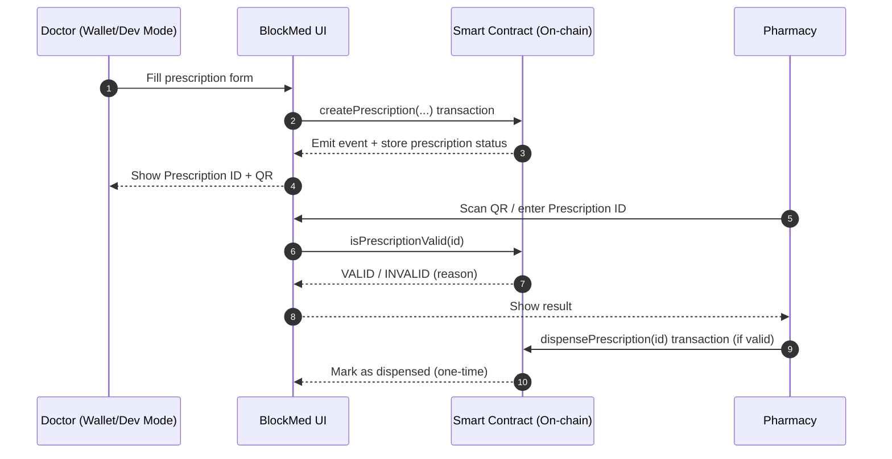

---

## 10) What exactly is stored? (BlockMed style)

### Minimum on-chain fields (conceptually)
- **Prescription ID**: unique number
- **patientHash**: patient identifier এর hash (raw PII না)
- **doctor address**: কে তৈরি করেছে
- **expiresAt**: validity date
- **isDispensed**: one-time check
- **dispensedBy**: কে dispense করলো

### Off-chain fields (conceptually)
- Patient full details
- Medicine list, dosage instructions
- Notes, attachments

---

## 11) Very small “exam-ready” glossary (1-page)

| Term | Bangla meaning | 1-line explanation |
|------|----------------|-------------------|
| Ledger | খাতা | যেখানে সব record জমা থাকে |
| Transaction | নতুন এন্ট্রি | নতুন তথ্য যোগ করার action |
| Block | পাতার মতো | অনেক transaction একসাথে |
| Blockchain | পাতার চেইন | blocks linked in order |
| Wallet | পরিচয় | address + private key |
| Address | অ্যাকাউন্ট নম্বর | public identity |
| Private Key | গোপন চাবি | signature দেয়, কাউকে দেয়া যাবে না |
| Smart Contract | নিয়মের কোড | automatic rules enforce করে |
| On-chain | চেইনে | public & permanent data |
| Off-chain | বাইরে | private/fast storage |
| Hash | ফিঙ্গারপ্রিন্ট | same input → same output, reverse hard |

---

## 12) Student demo tasks (Lab-style checklist)

### Task A: Run the project (চালাও)

```bash
npm install
npm run start
```

Then open:
- `http://localhost:3000`

### Task B: Use Dev Mode (MetaMask ছাড়া)
- Login page → **Use Dev Mode**
- Select a pre-funded account (Admin / Doctor / Pharmacist)

### Task C: Create a prescription (Doctor)
- Go to Create Prescription
- Fill minimum fields
- Click create → get **Prescription ID + QR**

### Task D: Verify + Dispense (Pharmacy)
- Pharmacy Verification page
- Scan QR / enter ID
- Verify status (VALID/INVALID)
- Dispense if valid → status becomes “dispensed”

### Task E: Try cheating (learn security)
- Same ID আবার dispense করতে গেলে → should reject (already dispensed)
- Expired হলে → should reject

---

## 13) Important note (Privacy)

Blockchain is public forever. তাই:
- Patient name/phone/NID **on-chain রাখা যাবে না**
- On-chain only store **hash/ID/status**  

See also: `docs/PRIVACY_ONCHAIN.md`

---

## 14) Lecturer “talk track” (1-minute script)

আপনি ক্লাসে এভাবে বলতে পারেন:
- “Blockchain হলো digital khata—এখানে record add করা যায়, edit করা যায় না।”
- “BlockMed এ prescription create/dispense হলো transaction।”
- “Smart contract rules দেয়—একবার dispense হলে দ্বিতীয়বার হবে না।”
- “Sensitive patient data off-chain—blockchain-এ শুধু hash/status থাকে।”

---

## 15) Extra details: “Behind the scenes” (UI → Blockchain)

এখন আমরা একদম ধীরে ধীরে দেখি—আপনি UI-তে button চাপলে আসলে কী কী step হয়।

### 15.1 Doctor clicks “Create Prescription” (একটা transaction তৈরি হয়)
- **UI (React page)** form data collect করে
- UI **ethers.js** দিয়ে blockchain provider/signers এর সাথে connect করে
- UI smart contract function call করে (এটাই transaction)
- transaction chain-এ mine হলে contract state update হয়
- contract **event emit** করে (যেমন “PrescriptionCreated” টাইপ)
- UI event/receipt থেকে **Prescription ID** বের করে QR generate করে

Visual (simple flow):

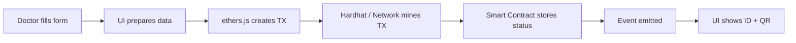

### 15.2 Pharmacy verifies (read call) vs dispenses (write TX)
- **Verify** = usually read-only call (fast, no gas in local demo)
- **Dispense** = write transaction (state changes: `isDispensed = true`)

Takeaway:
- **Read** = “দেখা/চেক করা”
- **Write** = “খাতায় নতুন লেখা যোগ করা” (transaction)

---

## 16) Graph: Prescription “state machine” (একবার dispense = forever)

এটা lecturer-দের জন্য খুব useful: prescription-এর life cycle.

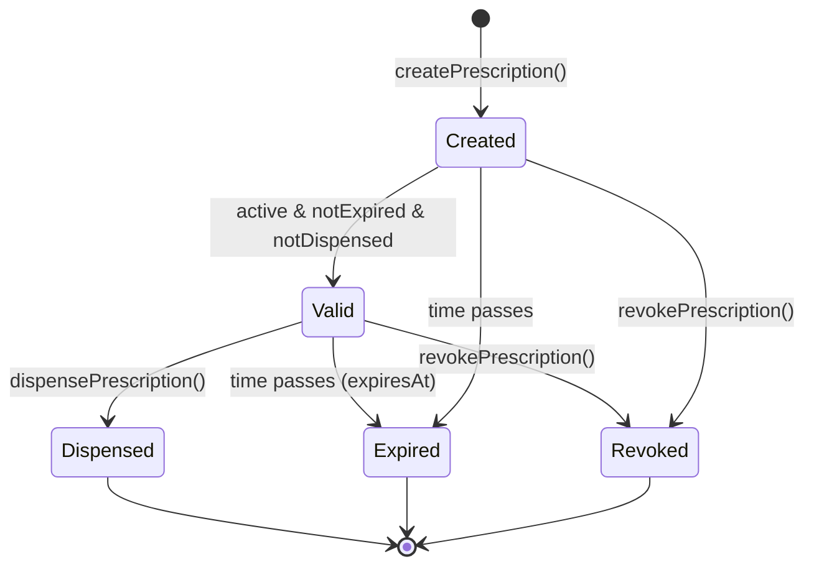

Key teaching line:
- **Dispensed** state থেকে “undo” করা যায় না (auditability + anti-reuse).

---

## 17) Graph: Roles (RBAC) — কে কোন কাজ করতে পারে?

BlockMed-এর smart contract এ role-based access থাকে (RBAC).
এটা মানে: “Doctor যা করবে Pharmacist তা করতে পারবে না”—rules enforce হয় code দিয়ে।

```mermaid
flowchart TB
  subgraph Roles [Roles (Wallet Address Based)]
    Admin[Admin]
    Doctor[Doctor]
    Pharmacist[Pharmacist]
    Manufacturer[Manufacturer]
    Patient[Patient]
    Regulator[Regulator]
  end

  subgraph Actions [Key actions]
    A1[Verify users]
    A2[Create / Update / Revoke prescription]
    A3[Dispense prescription]
    A4[Create medicine batch]
    A5[Recall / Flag batch]
    A6[View / Check status]
  end

  Admin --> A1
  Doctor --> A2
  Pharmacist --> A3
  Admin --> A3
  Manufacturer --> A4
  Regulator --> A5
  Patient --> A6
  Doctor --> A6
  Pharmacist --> A6
  Admin --> A6
  Regulator --> A6
```

---

## 18) Graph: Full system architecture (Big picture)

এখানে দেখানো হলো “UI + Blockchain + Optional Indexer + Database” কিভাবে connect হয়।

```mermaid
flowchart LR
  U[Users: Doctor / Pharmacy / Admin] --> UI[BlockMed Web UI]

  UI -->|Write TX| SC[Smart Contract<br/>(On-chain ledger)]
  UI -->|Read calls| SC

  SC -->|Events| IDX[Indexer (optional)<br/>Listens + builds history]
  IDX --> DB[(SQLite / DB)]
  UI -->|Query history fast| IDX

  note1((On-chain = truth<br/>Off-chain = speed)) --- SC
  note1 --- DB
```

Lecturer note:
- Blockchain = “final truth”
- Indexer/DB = “fast search & dashboards”

---

## 19) Hash graph (why patientHash is safe-ish)

Hash হলো “digital fingerprint”।

- Same input → same hash
- Slightly different input → completely different hash
- Reverse করা practically impossible (especially with **salt**)

```mermaid
flowchart TB
  P[Patient ID (NID/Student ID)] --> S[+ Salt]
  S --> H[Hash function (keccak256)]
  H --> PH[patientHash stored on-chain]

  PII((Raw PII)):::bad
  PII -. "Never store on-chain" .-> PH

  classDef bad fill:#ffefef,stroke:#cc0000,color:#660000;
```

---

## 20) Quick “graph-style” comparison: Traditional vs Blockchain

| Topic | Traditional (Central) | Blockchain (Shared) |
|------|------------------------|---------------------|
| Control | 1 authority | shared network rules |
| Edit/Delete | possible | practically impossible |
| Audit trail | can be altered | append-only history |
| Trust model | “trust the admin” | “trust the code + consensus” |


---

## 21) How BlockMed uses blockchain (সহজ সারাংশ)

BlockMed **blockchain-কে শুধু "proof খাতা" হিসেবে** ব্যবহার করে।

| কী জিনিস | কোথায় থাকে | Blockchain-এর ভূমিকা |
|----------|------------|------------------------|
| Prescription আছে কিনা, valid কিনা, একবার dispense হয়েছে কিনা | **On-chain** (Smart Contract) | সবার কাছে একই সত্য; কেউ জাল করতে পারবে না |
| Patient নাম, ওষুধের বিস্তারিত তালিকা | **Off-chain** (UI/DB) | Blockchain-এ না রাখাই ভালো (privacy) |

**সহজ ভাষায়:**
- Doctor prescription বানালে → contract-এ **একটা নতুন রেকর্ড** লেখা হয় (transaction)
- Pharmacy verify করলে → contract **পড়ে** দেখে valid কিনা (read)
- Pharmacy dispense করলে → contract-এ **"already dispensed"** লিখে দেওয়া হয় (transaction)
- একই prescription আবার dispense চাইলে → contract **reject** করে (rule)

**Graph: Project ↔ Blockchain**

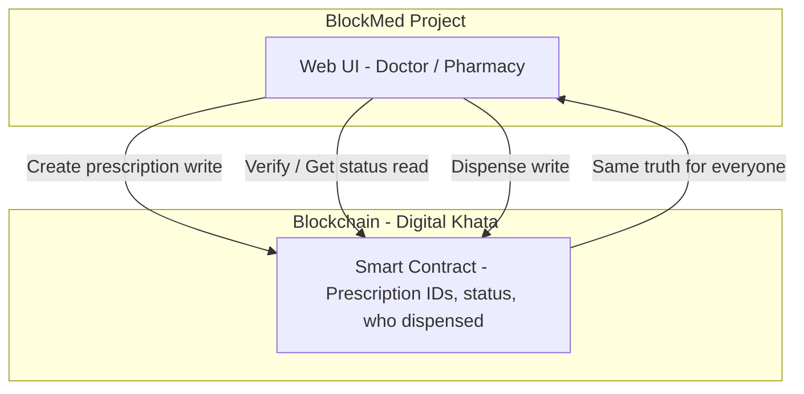

---

## 22) Every function — easy explain + graph

নিচে প্রতিটি **main function** এর কাজ একদম সহজ ভাষায় + ছোট graph।

### 22.1 addPrescription / createPrescription — প্রেসক্রিপশন তৈরি

**কী করে:** Doctor একটা নতুন prescription খাতায় লিখে। Contract একটা **নতুন ID** দেয়, expiry সময় সেট করে, আর **patientHash + ipfsHash** সেভ করে।  
**কে কল করে:** Doctor (verified)।  
**Blockchain-এ কী হয়:** একটা **নতুন transaction** — খাতায় নতুন লাইন যোগ হয়।

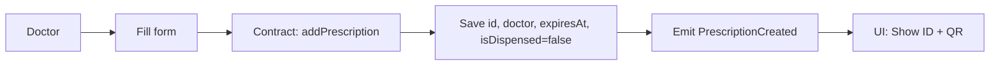

### 22.2 getPrescription — একটা প্রেসক্রিপশনের সব তথ্য দেখা

**কী করে:** Prescription ID দিলে contract থেকে সেই prescription-এর সব field **পড়ে** দেয়।  
**কে কল করে:** যেকেউ (read-only)।  
**Blockchain-এ কী হয়:** শুধু **পড়া**।

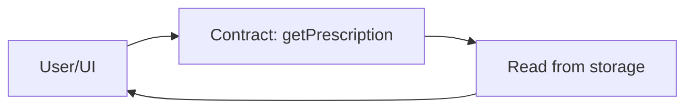

### 22.3 getPrescriptionsByPatient — এক patient-এর সব প্রেসক্রিপশন

**কী করে:** Patient-এর **hash** দিলে contract সেই patient-এর সব prescription ID-এর তালিকা দেয়।  
**কে কল করে:** যেকেউ (read-only)।  
**Blockchain-এ কী হয়:** শুধু **পড়া**।

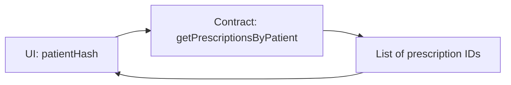

### 22.4 getPrescriptionsByDoctor — এক doctor-এর সব প্রেসক্রিপশন

**কী করে:** Doctor-এর **address** দিলে contract সেই doctor-এর তৈরি করা সব prescription ID দেয়।  
**কে কল করে:** যেকেউ (read-only)।  
**Blockchain-এ কী হয়:** শুধু **পড়া**।

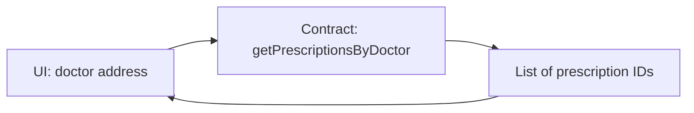

### 22.5 isPrescriptionValid — প্রেসক্রিপশন ভ্যালিড কিনা চেক

**কী করে:** Contract চেক করে: আছে কিনা, active কিনা, expire হয়নি তো, dispense হয়নি তো। সব ঠিক থাকলে **Valid**, নাহলে **Invalid + কারণ**।  
**কে কল করে:** Pharmacy/যেকেউ (read-only)।  
**Blockchain-এ কী হয়:** শুধু **পড়া**।

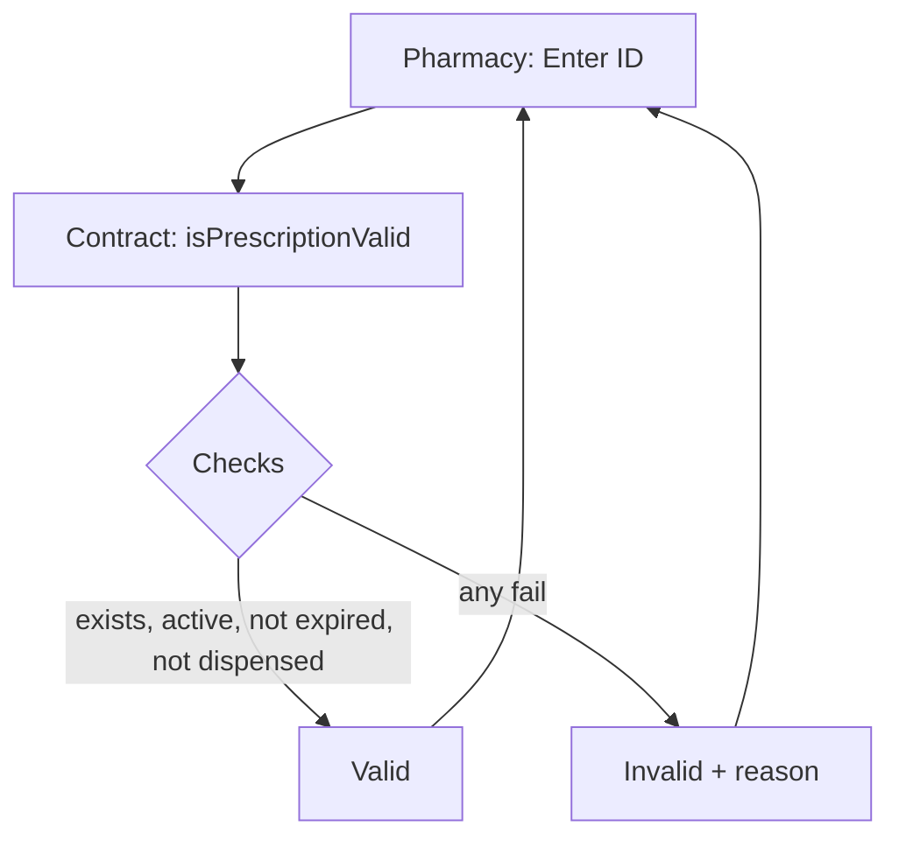

### 22.6 dispensePrescription — ওষুধ দিয়ে দিলাম (একবারই)

**কী করে:** Contract prescription-এ **isDispensed = true** করে, **dispensedBy** ও **dispensedAt** সেভ করে। ওই ID আবার dispense চাইলে contract **reject** করবে।  
**কে কল করে:** Pharmacist বা Admin।  
**Blockchain-এ কী হয়:** একটা **transaction**।

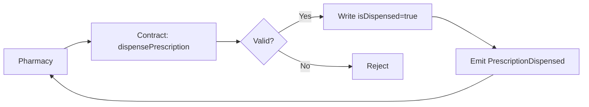

### 22.7 updatePrescription — প্রেসক্রিপশন আপডেট (নতুন ভার্সন)

**কী করে:** Doctor একই prescription-এর জন্য নতুন বিস্তারিত দেয়; contract **version** বাড়ায় এবং version history-তে রাখে।  
**কে কল করে:** যে doctor prescription বানিয়েছিল।  
**Blockchain-এ কী হয়:** একটা **transaction**।

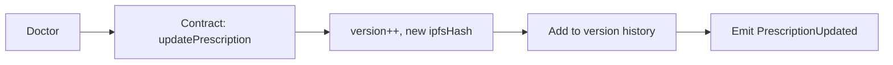

### 22.8 revokePrescription — প্রেসক্রিপশন বাতিল

**কী করে:** Contract prescription-এর **isActive = false** করে। আর dispense বা valid হিসেবে ব্যবহার করা যাবে না।  
**কে কল করে:** যে doctor বানিয়েছিল, অথবা Admin।  
**Blockchain-এ কী হয়:** একটা **transaction**।

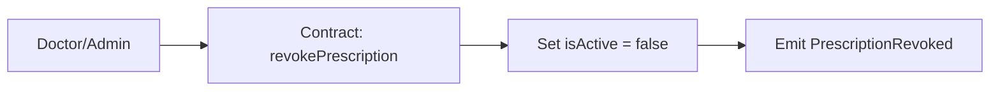

### 22.9 getPrescriptionVersions — প্রেসক্রিপশনের ভার্সন হিস্ট্রি

**কী করে:** Prescription ID দিলে contract সেই prescription-এর সব **version** এর তালিকা দেয়।  
**কে কল করে:** যেকেউ (read-only)।  
**Blockchain-এ কী হয়:** শুধু **পড়া**।

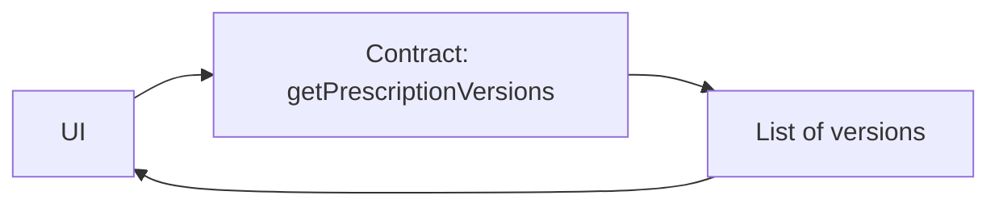

---

## 23) Summary table: Function ↔ Blockchain

| Function | Type | Blockchain-এ কী হয় | কে ব্যবহার করে |
|----------|------|----------------------|-----------------|
| addPrescription / createPrescription | **Write (TX)** | নতুন prescription খাতায় লেখা | Doctor |
| getPrescription | Read | খাতা থেকে পড়া | যেকেউ |
| getPrescriptionsByPatient | Read | খাতা থেকে পড়া | যেকেউ |
| getPrescriptionsByDoctor | Read | খাতা থেকে পড়া | যেকেউ |
| isPrescriptionValid | Read | খাতা থেকে পড়ে চেক | Pharmacy/যেকেউ |
| dispensePrescription | **Write (TX)** | খাতায় dispensed লিখা | Pharmacist/Admin |
| updatePrescription | **Write (TX)** | খাতায় নতুন ভার্সন | Doctor |
| revokePrescription | **Write (TX)** | খাতায় inactive লিখা | Doctor/Admin |
| getPrescriptionVersions | Read | খাতা থেকে পড়া | যেকেউ |

**সহজ নিয়ম:** **Write (TX)** = খাতায় নতুন/পরিবর্তন। **Read** = শুধু দেখা।
