# BlockMed Project - Complete Working Explanation (Bangla + English)

এই ডকুমেন্টে **BlockMed project-এর প্রতিটি অংশ** একদম সহজ ভাষায় ব্যাখ্যা করা হয়েছে—কীভাবে কাজ করে, কোথায় কী থাকে, প্রতিটি function কী করে।

---

## 📋 Table of Contents

1. [High-level Flow (Overview)](#high-level-flow)
2. [Core Components](#core-components)
3. [Smart Contract Functions](#smart-contract-functions)
4. [Frontend Pages Explained](#frontend-pages-explained)
5. [Data Flow Diagrams](#data-flow-diagrams)
6. [Complete Feature Breakdown](#complete-feature-breakdown)

---

## 🎯 High-level Flow (Overview)

### Step-by-Step: Doctor থেকে Pharmacy পর্যন্ত

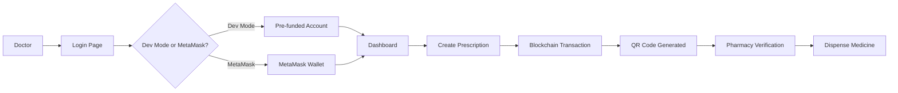

**সহজ ভাষায়:**

1. **Doctor** web app open করে (`http://localhost:3000`)
2. **Login Page** → Dev Mode বা MetaMask দিয়ে connect করে
3. **Dashboard** → Connected wallet address দেখে
4. **Create Prescription** → Form fill করে → Submit
5. **Blockchain Transaction** → Smart contract-এ prescription save হয়
6. **QR Code** → Generate হয় (prescription ID + data)
7. **Pharmacy** → QR scan করে → Verify করে → Dispense করে

---

## 🔥 Core Components (Main Parts)

### 1️⃣ Smart Contract – `contracts/BlockMedV2.sol`

**Purpose:** Prescription এবং medicine batch blockchain-এ store করা, যাতে কেউ edit করতে না পারে (immutability)।

**Important Parts:**

#### Structs (Data Structures)

```solidity
struct Prescription {
    uint256 id;              // Unique prescription ID
    string patientHash;      // Patient identifier hash (no raw PII)
    string ipfsHash;        // Prescription details (JSON/IPFS)
    address doctor;         // Doctor's wallet address
    uint256 createdAt;      // Creation timestamp
    uint256 expiresAt;      // Expiry date
    bool isDispensed;       // One-time use check
    address dispensedBy;    // Who dispensed
    uint256 dispensedAt;    // Dispense timestamp
    uint256 version;         // Version number (for updates)
    bool isActive;          // Active/revoked status
    string digitalSignature; // Optional signature
}
```

**Bangla Meaning:**
- `id` → প্রেসক্রিপশনের unique নম্বর
- `patientHash` → রোগীর hash (নাম/phone on-chain না)
- `ipfsHash` → প্রেসক্রিপশনের বিস্তারিত তথ্য
- `doctor` → কোন doctor তৈরি করেছে (wallet address)
- `isDispensed` → একবার dispense হয়েছে কিনা (true/false)

#### Mappings (Storage)

```solidity
mapping(uint256 => Prescription) public prescriptions;
mapping(string => uint256[]) public patientPrescriptions;
mapping(address => uint256[]) public doctorPrescriptions;
```

**Bangla Meaning:**
- `prescriptions` → ID দিয়ে prescription lookup
- `patientPrescriptions` → Patient hash দিয়ে সব prescription ID পাওয়া
- `doctorPrescriptions` → Doctor address দিয়ে সব prescription ID পাওয়া

---

### 2️⃣ Contract Interface (Frontend Connection)

**Files:**
- `src/utils/contractABI.json` → Smart contract-এর ABI (functions, parameters)
- `src/utils/config.js` → Contract address + network config

**কী কাজ করে:**
- Frontend contract-এর function call করতে পারে
- Contract address জানতে পারে
- Network (Hardhat Local, Sepolia, etc.) configure করতে পারে

**Without these:** Frontend contract-এর সাথে কথা বলতে পারবে না ❌

---

### 3️⃣ App Routing – `src/App.jsx`

**What it does:**

```javascript
const [account, setAccount] = useState(null)

// If no account → Show Login Page
// If account exists → Show Dashboard + Routes
```

**Routes:**
- `/` → Dashboard
- `/prescription/create` → Create Prescription
- `/pharmacy/verify` → Pharmacy Verification
- `/templates` → Prescription Templates
- `/patient` → Patient Portal
- `/analytics` → Analytics (Admin)
- `/users` → User Management (Admin)
- `/activity` → Activity Log

**Bangla Meaning:**
- `account` → Connected wallet address (null হলে login page)
- Routes → URL অনুযায়ী different page show করে

---

### 4️⃣ Login Page – `src/pages/LoginPage.jsx`

**What it does:**

#### Dev Mode Option
- Pre-funded Hardhat accounts list করে
- Select করলে → Account set হয় (MetaMask লাগে না)

#### MetaMask Option
- Browser-এ MetaMask আছে কিনা check করে
- `eth_requestAccounts` call করে → MetaMask pop-up
- Connect হলে → Account save হয়

**Flow:**

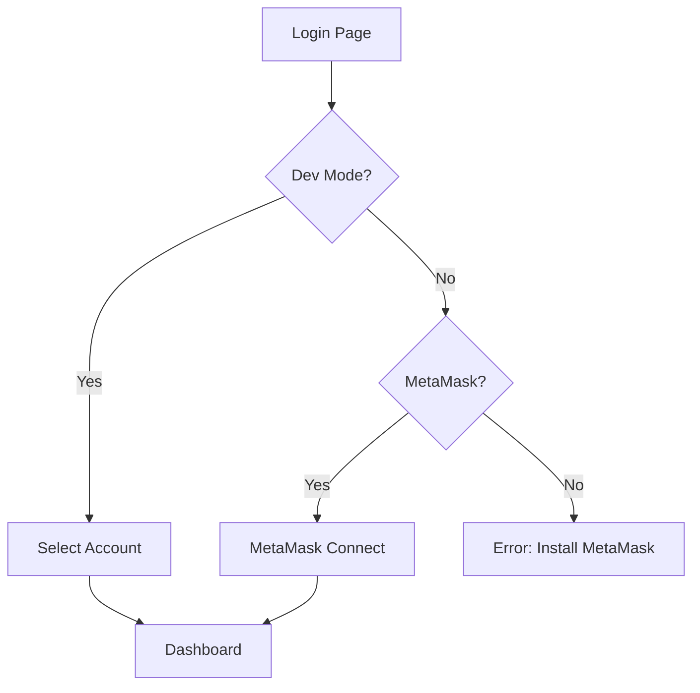

---

### 5️⃣ Dashboard – `src/pages/Dashboard.jsx`

**What it shows:**

1. **Project Title** → "BlockMed"
2. **Connected Wallet Address** → Doctor/User address
3. **Quick Actions:**
   - Create Prescription
   - Verify Prescription
   - View Templates
   - Patient Portal
4. **Role-based Menu** → Doctor/Pharmacist/Admin-এর জন্য আলাদা options

**Bangla Meaning:**
- Dashboard = Home page
- এখান থেকে সব main features-এ যাওয়া যায়

---

### 6️⃣ Create Prescription – `src/pages/CreatePrescription.jsx`

**Step-by-Step Process:**

#### Step 1: Form Fill
- Patient Info (name, age, gender)
- Symptoms
- Diagnosis
- Medicines (search + add)
- Tests
- Advice
- Follow-up date

#### Step 2: Generate Summary
```javascript
const summary = {
  patient, symptoms, diagnosis, medicines,
  tests, advice, followUp, createdAt
}
```

#### Step 3: Create Patient Hash
```javascript
const patientHash = btoa(`${patient.name}|${patient.age}|${Date.now()}`)
```

**Bangla Meaning:**
- Patient hash → Privacy-এর জন্য (raw name on-chain না)

#### Step 4: Blockchain Submission (Optional)
```javascript
const tx = await contract.addPrescription(patientHash, ipfsHash)
await tx.wait()
const prescriptionId = await contract.prescriptionCount()
```

**Flow:**

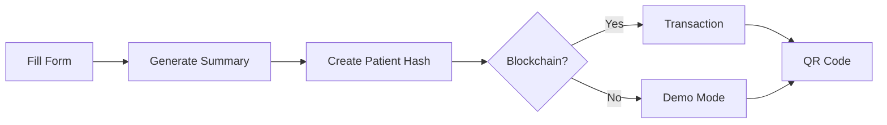

#### Step 5: QR Code Generation
```javascript
const qrData = JSON.stringify({
  prescriptionId: id,
  patientHash: patientHash,
  ipfsHash: ipfsHash
})
```

**QR Code contains:**
- Prescription ID
- Patient Hash
- IPFS Hash (full prescription data)

---

### 7️⃣ Pharmacy Verification – `src/pages/PharmacyVerification.jsx`

**What it does:**

#### Option 1: Enter Prescription ID
```javascript
const prescription = await contract.getPrescription(id)
```

#### Option 2: Scan QR Code
- QR scan → JSON parse → Extract `prescriptionId`

#### Verification Check
```javascript
const isValid = await contract.isPrescriptionValid(id)
// Returns: (bool isValid, string status)
```

**Checks:**
- ✅ Exists?
- ✅ Active?
- ✅ Not expired?
- ✅ Not dispensed?

#### Dispense (If Valid)
```javascript
const tx = await contract.dispensePrescription(id)
await tx.wait()
// Sets: isDispensed = true, dispensedBy = msg.sender
```

**Flow:**

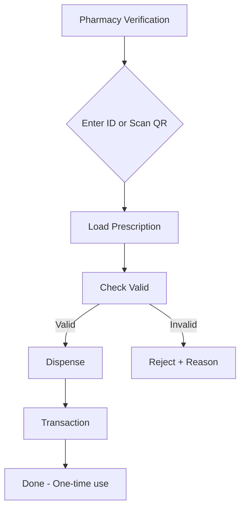

---

## 📜 Smart Contract Functions (Detailed)

### Function 1: `addPrescription(patientHash, ipfsHash)`

**What it does:**
- নতুন prescription blockchain-এ store করে
- Auto ID generate করে (`prescriptionCount++`)
- Expiry time set করে (default 30 days)
- Event emit করে (`PrescriptionCreated`)

**Who can call:** Doctor (verified)

**Blockchain-এ কী হয়:**
- নতুন transaction → Block-এ add হয়
- Prescription data permanently store হয়

**Graph:**

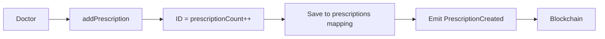

---

### Function 2: `getPrescription(id)`

**What it does:**
- Prescription ID দিয়ে সব details return করে

**Who can call:** Anyone (read-only)

**Returns:**
```solidity
Prescription memory {
  id, patientHash, ipfsHash, doctor,
  createdAt, expiresAt, isDispensed,
  dispensedBy, dispensedAt, version, isActive
}
```

**Graph:**

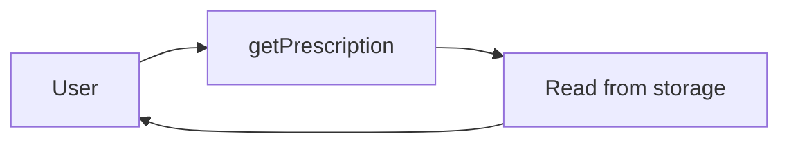

---

### Function 3: `isPrescriptionValid(id)`

**What it does:**
- Prescription valid কিনা check করে

**Checks:**
1. Exists? (`id > 0 && id <= prescriptionCount`)
2. Active? (`isActive == true`)
3. Not expired? (`block.timestamp < expiresAt`)
4. Not dispensed? (`isDispensed == false`)

**Returns:**
```solidity
(bool isValid, string memory status)
// Example: (true, "Valid") or (false, "Already dispensed")
```

**Graph:**

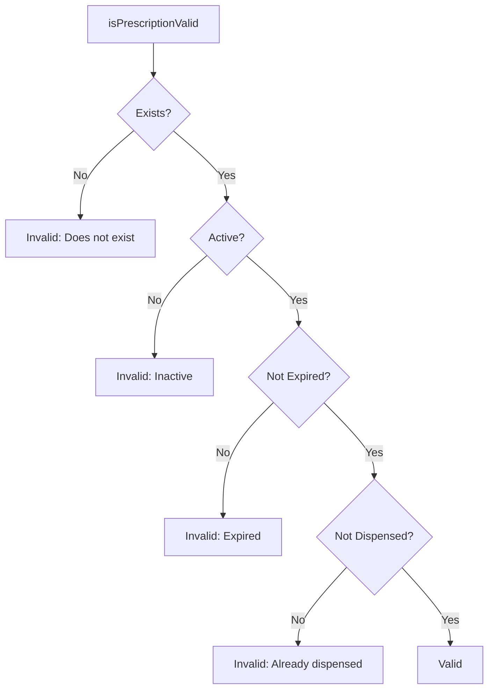

---

### Function 4: `dispensePrescription(id)`

**What it does:**
- Prescription dispense করে (one-time)
- `isDispensed = true` set করে
- `dispensedBy` এবং `dispensedAt` save করে

**Who can call:** Pharmacist or Admin

**Requirements:**
- Prescription must exist
- Must be active
- Must not be expired
- Must not be already dispensed

**Graph:**

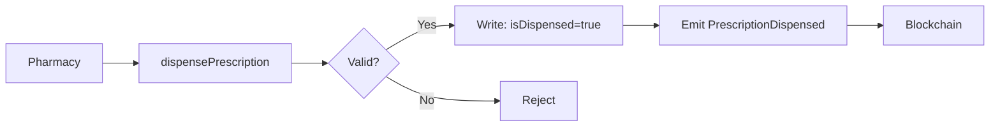

---

### Function 5: `updatePrescription(id, newIpfsHash, reason)`

**What it does:**
- Prescription update করে (new version)
- Version number increment করে
- Version history-তে add করে

**Who can call:** Prescribing Doctor only

**Requirements:**
- Must be prescribing doctor
- Must be active
- Must not be dispensed
- Must not be expired

**Graph:**

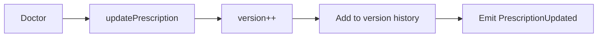

---

### Function 6: `revokePrescription(id, reason)`

**What it does:**
- Prescription revoke করে (`isActive = false`)
- আর dispense করা যাবে না

**Who can call:** Prescribing Doctor or Admin

**Graph:**

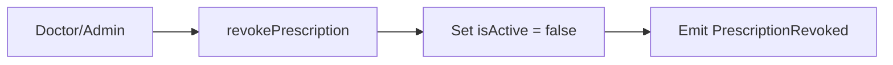

---

### Function 7: `getPrescriptionsByPatient(patientHash)`

**What it does:**
- Patient hash দিয়ে সব prescription ID return করে

**Returns:** `uint256[]` (array of prescription IDs)

**Graph:**

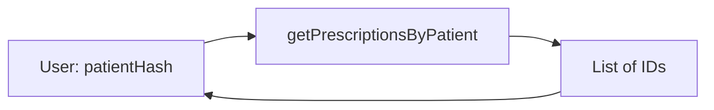

---

### Function 8: `getPrescriptionsByDoctor(doctorAddress)`

**What it does:**
- Doctor address দিয়ে সব prescription ID return করে

**Returns:** `uint256[]` (array of prescription IDs)

**Graph:**

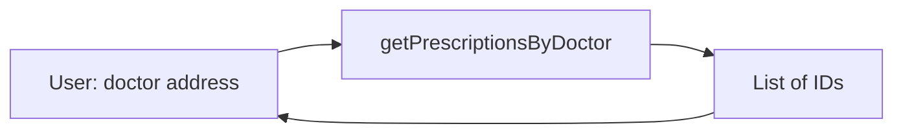

---

## 🖥️ Frontend Pages Explained

### Page 1: LoginPage.jsx

**Purpose:** User authentication (Dev Mode or MetaMask)

**Key Functions:**

#### handleDevModeLogin(account)
```javascript
setAccount(account)
// Sets connected account (no MetaMask needed)
```

#### handleMetaMaskConnect()
```javascript
const provider = new ethers.BrowserProvider(window.ethereum)
const accounts = await provider.send("eth_requestAccounts", [])
setAccount(accounts[0])
```

**UI Elements:**
- Dev Mode account selector
- MetaMask connect button
- Network info display

---

### Page 2: Dashboard.jsx

**Purpose:** Main landing page after login

**What it shows:**
- Welcome message
- Connected account address
- Quick action buttons
- Role-based navigation menu

**Key Functions:**
- `handleCreatePrescription()` → Navigate to create page
- `handleVerifyPrescription()` → Navigate to verify page
- `handleViewTemplates()` → Navigate to templates page

---

### Page 3: CreatePrescription.jsx

**Purpose:** Create new prescription (5-step form)

**Steps:**

#### Step 1: Patient Information
- Name, Age/DOB, Gender

#### Step 2: Symptoms & Diagnosis
- Symptoms textarea
- Diagnosis textarea

#### Step 3: Medicines
- Medicine search component
- Add/remove medicines
- Dosage, frequency, duration

#### Step 4: Tests & Advice
- Lab tests input
- Doctor advice textarea
- Follow-up date

#### Step 5: Review & Submit
- Preview prescription
- Generate QR code
- Submit to blockchain (optional)

**Key Functions:**

```javascript
const handleSubmit = async () => {
  // 1. Validate form
  // 2. Generate patient hash
  // 3. Create summary JSON
  // 4. Call contract.addPrescription()
  // 5. Get prescription ID
  // 6. Generate QR code
}
```

---

### Page 4: PharmacyVerification.jsx

**Purpose:** Verify and dispense prescriptions

**Features:**

#### Prescription Lookup
- By ID (manual input)
- By QR scan
- By patient hash/NID

#### Verification
```javascript
const result = await contract.isPrescriptionValid(id)
if (result.isValid) {
  // Show valid status
} else {
  // Show error: result.status
}
```

#### Dispense
```javascript
const tx = await contract.dispensePrescription(id)
await tx.wait()
// Prescription marked as dispensed (one-time)
```

**UI Elements:**
- Search input
- QR scanner button
- Prescription details card
- Verify button
- Dispense button

---

### Page 5: PrescriptionTemplates.jsx

**Purpose:** Save and reuse prescription templates

**How it works:**

#### Save Template
```javascript
const template = {
  name: "Fever Template",
  category: "fever",
  symptoms: "...",
  diagnosis: "...",
  medicines: [...],
  // ... other fields
}
localStorage.setItem('blockmed-templates', JSON.stringify([...templates, template]))
```

#### Load Templates
```javascript
const templates = JSON.parse(localStorage.getItem('blockmed-templates') || '[]')
```

#### Apply Template
- Click template → Auto-fill form → Navigate to create page

**Storage:** Browser localStorage (not blockchain)

**Reason:** Personal data, fast access, no gas fee

---

### Page 6: PatientPortal.jsx

**Purpose:** Patient view (search prescriptions by patient hash/NID)

**How it works:**

```javascript
const patientHash = generatePatientHash(patientNID)
const prescriptionIds = await contract.getPrescriptionsByPatient(patientHash)
// Load each prescription
for (let id of prescriptionIds) {
  const p = await contract.getPrescription(id)
  // Display prescription
}
```

**Features:**
- Search by NID/patient hash
- View all prescriptions
- Download/print prescription

---

### Page 7: ActivityLog.jsx

**Purpose:** View system activity (blockchain events)

**How it works:**

#### Load Events
```javascript
// Scan last 10,000 blocks
for (let i = latestBlock; i > latestBlock - 10000; i--) {
  const block = await provider.getBlock(i)
  // Get events from block
  const events = await contract.queryFilter(filter, i, i)
}
```

#### Event Types:
- `PrescriptionCreated`
- `PrescriptionDispensed`
- `PrescriptionUpdated`
- `PrescriptionRevoked`
- `UserRegistered`
- `UserVerified`
- `BatchCreated`
- `BatchRecalled`

**Features:**
- Filter by event type
- Filter by date range
- Search by transaction hash
- Export to CSV

---

### Page 8: UserManagement.jsx (Admin Only)

**Purpose:** Manage users (verify, deactivate, restrict)

**Features:**

#### Load Users
```javascript
const userAddresses = await contract.getAllUsers()
for (let addr of userAddresses) {
  const user = await contract.getUser(addr)
  // Display user info
}
```

#### Verify User
```javascript
const tx = await contract.verifyUser(userAddress)
await tx.wait()
// User verified (can now use role functions)
```

#### Deactivate User
```javascript
const tx = await contract.deactivateUser(userAddress)
await tx.wait()
// User deactivated (cannot use system)
```

**Access Control:**
- Only Admin role can access
- Checks blockchain role before allowing

---

### Page 9: Analytics.jsx

**Purpose:** System statistics and charts

**Metrics:**
- Total prescriptions
- Total dispensations
- Active users
- Prescriptions by doctor
- Dispensations by pharmacy
- Medicine batch statistics

**Data Source:**
- Blockchain contract calls
- Event indexer (if enabled)
- LocalStorage (for demo data)

---

### Page 10: BatchManagement.jsx

**Purpose:** Create and manage medicine batches (Manufacturer role)

**Features:**

#### Create Batch
```javascript
const tx = await contract.createMedicineBatch(
  batchNumber,
  medicineName,
  genericName,
  expiresAt,
  origin,
  ipfsHash,
  totalUnits
)
```

#### Dispense from Batch
```javascript
const tx = await contract.dispenseFromBatch(batchId, units)
// Reduces available units
```

#### Recall Batch
```javascript
const tx = await contract.recallBatch(batchId, reason)
// Marks batch as recalled
```

---

## 🔄 Data Flow Diagrams

### Complete Flow: Doctor → Blockchain → Pharmacy

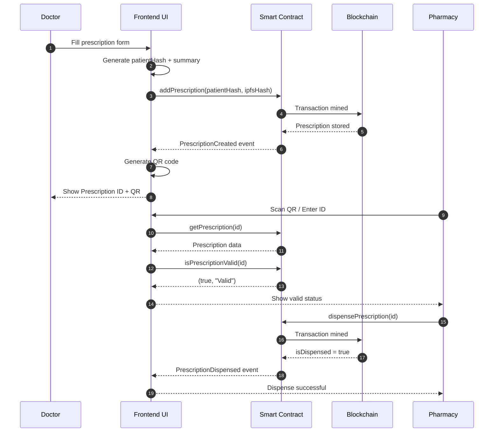

---

### State Management Flow

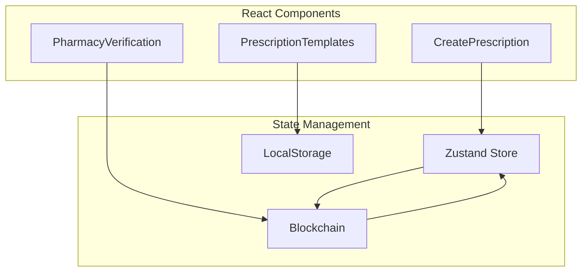

**Explanation:**
- **Zustand Store** → Global state (user, account, demo data)
- **LocalStorage** → Templates, restrictions, demo prescriptions
- **Blockchain** → Permanent prescription data

---

## 🎯 Complete Feature Breakdown

### Feature 1: Dev Mode

**What it is:**
- Pre-funded Hardhat accounts
- No MetaMask needed
- Fast development

**How it works:**

```javascript
// src/utils/devMode.js
const accounts = [
  { address: "0x...", privateKey: "0x...", role: "Admin" },
  { address: "0x...", privateKey: "0x...", role: "Doctor" },
  // ... more accounts
]

const provider = new ethers.JsonRpcProvider("http://localhost:8545")
const signer = new ethers.Wallet(account.privateKey, provider)
```

**Benefits:**
- No wallet setup needed
- Instant transactions
- Free gas (local network)

---

### Feature 2: Demo Mode

**What it is:**
- Create prescriptions without blockchain
- LocalStorage-এ store
- Later blockchain-এ save করা যায়

**How it works:**

```javascript
// If blockchain not connected
if (!isConnected) {
  const demoPrescription = {
    id: Date.now(),
    patientHash: "...",
    ipfsHash: "...",
    // ... other fields
  }
  // Save to localStorage
  const demos = JSON.parse(localStorage.getItem('demo-prescriptions') || '[]')
  demos.push(demoPrescription)
  localStorage.setItem('demo-prescriptions', JSON.stringify(demos))
}
```

**Use Case:**
- Blockchain offline হলে
- Testing করার জন্য
- Demo presentation

---

### Feature 3: QR Code System

**What it contains:**

```json
{
  "prescriptionId": "123",
  "patientHash": "abc123...",
  "ipfsHash": "QmXYZ..."
}
```

**How it's used:**

1. **Generate** → Create prescription → QR code shown
2. **Print** → Prescription print → QR code included
3. **Scan** → Pharmacy scans → Extract prescription ID
4. **Verify** → Load prescription → Check validity

**Library:** `qrcode.react` (QRCodeSVG component)

---

### Feature 4: Role-Based Access Control (RBAC)

**Roles:**

| Role | Value | Permissions |
|------|-------|-------------|
| Admin | 1 | Verify users, deactivate users, dispense |
| Doctor | 2 | Create/update/revoke prescriptions |
| Pharmacist | 3 | Dispense prescriptions, verify batches |
| Manufacturer | 4 | Create batches, recall own batches |
| Patient | 5 | View prescriptions (read-only) |
| Regulator | 6 | Recall any batch, flag batches |

**How it works:**

```javascript
const user = await contract.getUser(account)
const role = Number(user.role)

if (role === 2) { // Doctor
  // Show create prescription button
} else if (role === 3) { // Pharmacist
  // Show verify/dispense button
}
```

---

### Feature 5: Prescription Templates

**Storage:** Browser localStorage

**Structure:**

```json
{
  "id": "template-001",
  "name": "Fever Template",
  "category": "fever",
  "symptoms": "High fever, body ache",
  "diagnosis": "Viral fever",
  "medicines": [
    {
      "name": "Paracetamol",
      "dose": "500mg",
      "frequency": "Twice daily",
      "duration": "5 days"
    }
  ],
  "tests": "CBC, Blood sugar",
  "advice": "Rest, drink water",
  "followUp": "3 days",
  "createdAt": "2024-01-15T10:30:00Z"
}
```

**Operations:**
- **Save** → Current prescription → Save as template
- **Load** → Select template → Auto-fill form
- **Edit** → Modify template → Update localStorage
- **Delete** → Remove template

**Why localStorage?**
- Personal data (each doctor's own templates)
- Fast access (no blockchain call)
- No gas fee
- Privacy (not on public blockchain)

---

### Feature 6: Activity Log System

**What it tracks:**

#### Blockchain Events:
- `PrescriptionCreated` → Doctor creates prescription
- `PrescriptionDispensed` → Pharmacy dispenses
- `PrescriptionUpdated` → Doctor updates prescription
- `PrescriptionRevoked` → Doctor/Admin revokes
- `UserRegistered` → New user registration
- `UserVerified` → Admin verifies user
- `BatchCreated` → Manufacturer creates batch
- `BatchRecalled` → Batch recalled

#### LocalStorage Events:
- `UserLogin` → User logs in
- `TemplateSaved` → Template created
- `DemoPrescriptionCreated` → Demo prescription created

**How it works:**

```javascript
// Scan last 10,000 blocks
const latestBlock = await provider.getBlockNumber()
for (let i = latestBlock; i > latestBlock - 10000; i--) {
  const events = await contract.queryFilter(filter, i, i)
  for (let event of events) {
    // Process event
    activities.push({
      type: event.name,
      block: event.blockNumber,
      txHash: event.transactionHash,
      data: event.args,
      timestamp: await getBlockTimestamp(i)
    })
  }
}
```

**Features:**
- Filter by event type
- Filter by date range
- Search by transaction hash
- Export to CSV

---

### Feature 7: User Management (Admin)

**Functions:**

#### 1. Load All Users
```javascript
const addresses = await contract.getAllUsers()
for (let addr of addresses) {
  const user = await contract.getUser(addr)
  // Display: name, role, verified, active
}
```

#### 2. Verify User
```javascript
const tx = await contract.verifyUser(userAddress)
await tx.wait()
// User can now use role functions
```

#### 3. Deactivate User
```javascript
const tx = await contract.deactivateUser(userAddress)
await tx.wait()
// User cannot use system
```

#### 4. Restrict User (LocalStorage)
```javascript
const restrictions = JSON.parse(localStorage.getItem('user-restrictions') || '{}')
restrictions[userAddress] = {
  restricted: true,
  reason: "Violation",
  expiresAt: "2024-12-31"
}
localStorage.setItem('user-restrictions', JSON.stringify(restrictions))
```

**Access Control:**
- Only Admin role can access
- Checks blockchain role before allowing

---

### Feature 8: Medicine Batch Management

**Create Batch (Manufacturer):**

```javascript
const tx = await contract.createMedicineBatch(
  "BATCH-001",           // batchNumber
  "Paracetamol 500mg",  // medicineName
  "Paracetamol",        // genericName
  1735689600,           // expiresAt (timestamp)
  "India",              // origin
  "QmXYZ...",          // ipfsHash
  1000                  // totalUnits
)
```

**Dispense from Batch (Pharmacist):**

```javascript
const tx = await contract.dispenseFromBatch(batchId, 10)
// Reduces available units: dispensedUnits += 10
```

**Recall Batch:**

```javascript
// Manufacturer can recall own batches
const tx = await contract.recallBatch(batchId, "Quality issue")

// Regulator can recall any batch
const tx = await contract.recallBatch(batchId, "Safety concern")
```

**Verify Batch:**

```javascript
const batch = await contract.getMedicineBatch(batchId)
// Check: isRecalled, isFlagged, expiresAt, origin
```

---

## 📊 Complete System Architecture

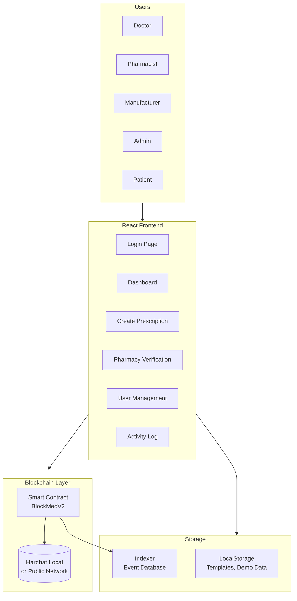

---

## 🔐 Security Features

### 1. Role-Based Access
- Smart contract-এ role check
- Frontend-এ UI hide/show based on role

### 2. Prescription Immutability
- Once created → Cannot edit (only update creates new version)
- Once dispensed → Cannot dispense again

### 3. Patient Privacy
- No raw PII on-chain
- Only patient hash stored
- Full details in IPFS/off-chain

### 4. Transaction Verification
- All writes require signature
- Events logged for audit trail

---

## 🎓 Summary (TL;DR)

### What BlockMed Does:

1. **Doctors** → Create prescriptions → Store on blockchain → Generate QR
2. **Pharmacies** → Scan QR → Verify → Dispense (one-time)
3. **Patients** → View prescription history
4. **Manufacturers** → Create medicine batches → Track authenticity
5. **Admins** → Manage users → View analytics

### Key Technologies:

- **Frontend:** React, Vite, TailwindCSS
- **Blockchain:** Solidity, Hardhat, ethers.js
- **Storage:** Blockchain (on-chain), LocalStorage (off-chain)
- **QR:** qrcode.react library

### Data Flow:

```
User Input → Frontend Form → Smart Contract → Blockchain → Event → Indexer → UI Update
```

---

## 📝 Important Notes

1. **Blockchain is Public** → Never store PII on-chain
2. **One-time Dispense** → Smart contract enforces (cannot reuse)
3. **Demo Mode** → Works without blockchain (localStorage)
4. **Dev Mode** → Pre-funded accounts (no MetaMask needed)
5. **Templates** → LocalStorage (personal, fast, free)

---

**End of Document**

*This document covers all major parts of the BlockMed project. For specific implementation details, refer to the source code files mentioned in each section.*
